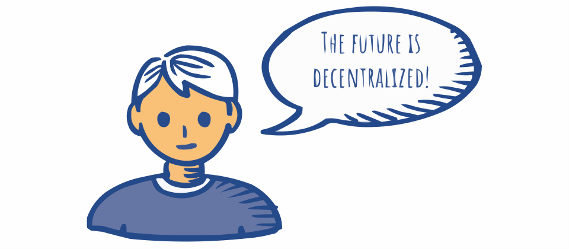
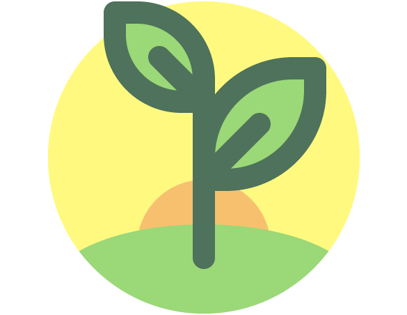

# Cleanchain

In this digital age, blockchain technology has the power to gather, filter and trace digital informations in order to create the right trust through a secure and decentralised net.

A blockchain is a distributed database: a digital register that publicly stores encoded informations on the internet. It is a very powerful and versatile tool, able to be adapted for different solutions in different environments and [our goal is to improve transparency and efficiency](goal.md) of the food chain industry through its use.

## Who are we

We are 3 students from the [University of Pisa](https://www.unipi.it/index.php/english) currently working on this project for [EUAcceL 2021](https://eit-hei.eu/assets/pdf/fact-sheets/EIT-Project-Fact-Sheet-EUAcceL.pdf), organized by the European Institute of tecnology.

- Project email: [`chain.clean@protonmail.com`](mailto:chain.clean@protonmail.com)
- [Team members contacts](contacts.md)

## Work in progress 

- [Preliminary presentation EUAcceL](cleanchain_teamballo.pdf)

<!-- Stay tuned for further updates. -->
